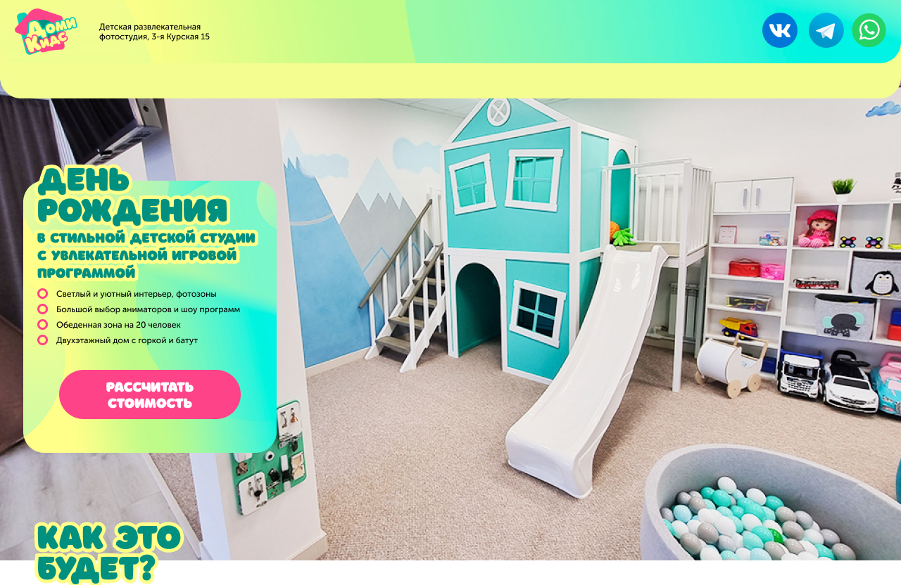

# $\color{yellowgreen}\text{ДомиКидс}$

$\color{limegreen}\text{Landing page}$

## $\color{mediumblue}\text{Описание работы }$:

Внешняя часть одностраничного сайта детской развлекательной фотостудии.

Макет сайта взят произвольно из сети.

### Мои задачи :

🎯 Отработать внедрение "слайдеров" на страницу .

🎯 Освоить добавление "всплывающих окон" на страницу.

🎯 $\color{mediumblue}\text{Основная задача}$ - улучшение навыков вёрстки.

---

Макет -> [**Figma**](https://www.figma.com/file/tqGESbkuzGJ3C3VNObTP7C/%D0%94%D0%BE%D0%BC%D0%B8%D0%9A%D0%B8%D0%B4%D1%81?type=design&node-id=0-1&mode=design&t=8DY6NerXP8pDezFP-0)

Вёрстка -> [**Git pages**](https://artiom-work.github.io/domi-kids/)

## $\color{mediumblue}\text{Технологии, инструменты и способы вёрстки }$:

❗Figma.
❗VsCode.
❗Git.
❗Семантика.
❗БЭМ.
❗Адаптивная вёрстка.
❗Кроссбраузерность.
❗Использование CSS переменных.
❗FlexBox.
❗Grid.
❗Мобильное "бургер-меню" ( _CSS_ ).
❗"Слайдеры" ( _CSS + JS_ ).
❗Всплывающие окна ( _CSS + JS_ ).
❗Валидация форм ( _CSS + JS_ ).
❗Яндекс-карта (_iframe_).
❗Эффекты hover и active.
❗Pixel-perfect.

---
